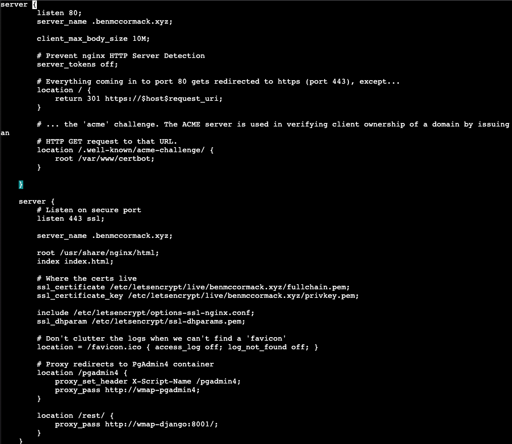

# Advanced Web Mapping Assignment #2

## Contents of Documentation

1. Setting up Django REST
2. Updating User Location in Database
3. Front End Functions for Login, Sign up, Logout and User Authentication
4. Querying Overpass and sending a response to the Front End
5. Deployment to the web
6. Tutorials Used to aid Implementation of Final Product

## Setting up Django REST

## Updating User Location in the Database

The user location is updated in the database by processing an AJAX request from the front end application and updating the location of the user. The identity of the user is retrieved by sending the users authentication as part of the AJAX request. The token is then taken by the back end and a user object is retrieved using the token. If the token is valid a user will be retrieved and the last_location field of the profile model relating to that user will be updated in the database.

### AJAX function for updating the users location

```Javascript
function update_db(lng, lat){
    let locString = lng + ", " + lat;

    $.ajax({
        type: "POST",
        headers: {
            "Authorization": "Token " + localStorage.authToken
        },
        url: HOST + "/api/updatedb/",
        data: {
            "last_location": locString
        }
    }).done(function(data, status, xhr){
        console.log("Location has been updated in the database.")
    }).fail(function (xhr,status,error){
        console.log("Updating the database has failed!");
    })
}
```

### Django function for updating the users location

```Python
   @api_view(['POST'])
def update_database(request):
    try:
        profile = Profile.objects.get(user=request.user)
    except Profile.DoesNotExist:
        return Response(status=status.HTTP_404_NOT_FOUND)

    if request.method == 'POST':
        data = request.data
        serializer = UpdateLocationSerializer(instance=profile, data=data)
        if serializer.is_valid():
            my_location = request.data['last_location']
            my_coords = [float(coord) for coord in my_location.split(", ")]
            profile.last_location = Point(my_coords)
            profile.save()
            serializer.save()

            return Response(data=data)
    return Response(data=serializer.errors, status=status.HTTP_400_BAD_REQUEST)
```

## Login, Register and Logout

### Login

The user logs in with a username and a password. The data entered by the user is passed to the back end application via an AJAX post request. The data is then taken by the login view and put through a serializer to ensure it is valid. If the serializer is valid, the user will be authenticated and a token will be sent back to the front end application where it will be stored in local storage as a variable called authToken.

### Register

A user registers with a username, email and password. This data is passed from the front end application to the back end where it is put through a serializer within the register view and the validity of the data is checked. If the serializer is valid and a user with the username provided does not already exist, the account will be created and the user will be redirected to the login screen where they can login to their newly created account.

### Logout

When a user executes the logout function the local storage variable containing their token is destroyed from local storage.

## Querying Overpass and sending a response to the Front End

### Front End Query

A query is sent to the back end that contains the users authToken, the bounding box (four corners of the maps coordinates) and the value to be searched for in this case "bar and pub".

### Back End Query

The query will then execute the QueryOverpass view which will send the data through a serializer, remove the stop word "and" and split the bouding boxes coordinates. If the serializer is valid the middle part of the query will be filled out and placed between the start and end of the query is a variable and a request will be sent to the overpass API. The response to this query will then be placed into GeoJSON format and sent back to the front end application where it can be parsed and markers can be created.

### Function to check if the user has been authenticated

I wrote a function check if the user was authenticated by trying to get the Profile object with a request to the back end using the auth token in local storage. If the token is not valid or doesnt exist the user will be redirected to login page from map page. This means you must be logged in with a valid token to use the map page.

```Javascript
function checkAuthentication(){
    // creating an ajax call to check if the user is authenticated
    // if authenticated return true otherwise send them to the homepage
    $.ajax({
        type: "POST",
        headers: {
            "Authorization": "Token " + localStorage.authToken
        },
        url: HOST + "/api/checkauthentication/",
    }).done(function(data, status, xhr){
        console.log("User token is valid.")
    }).fail(function (xhr,status,error){
        window.location.href = "index.html";
    })
}
```

## Deployment to the Web

Deployment to the web was a relatively straightforward process. The following steps were taken to deploy the application to the web.

1. Creating a Docker image of the django application and pusing the image to Docker Hub.
2. Pulling image down from Docker Hub onto digital ocean virtual machine.
3. Deleting the container running the web application from CA1.
4. Creating a new container that would replace the deleted container and use the image that had been pulled down from docker hub.
5. Recofniguring the nginx server.conf file to contain the following - this makes it so that the front end application is displayed when we go to the url of the website and the django application can be interacted with by including the URL + /rest/ + api_call_link/:
   
6. Front end application was then uploaded by connecting to digital ocean droplet with Filezilla and went to the directory of the volume that is linked to the Nginx container. The front end files were then placed into this directory replacing the index.html file that was already there.
7. Entering URL into the search bar of web browser now presented me with home page of front end application.

## Tutorials Used For Help In Creating Final Product

1. Django Knox Tutorial - https://www.section.io/engineering-education/api-authentication-with-django-knox-and-postman-testing/
2. PWA in JavaScript Tutorial - https://www.freecodecamp.org/news/build-a-pwa-from-scratch-with-html-css-and-javascript/
3. Custom Leaflet Icons - https://github.com/lennardv2/Leaflet.awesome-markers
4. Leaflet Clusters - https://github.com/Leaflet/Leaflet.markercluster
